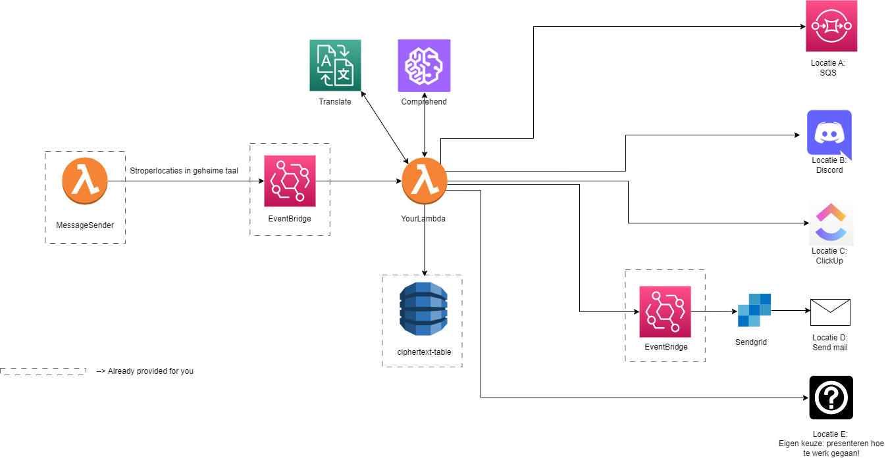

# HTF23 - Er hangt een cloud boven de jungle
There are poachers on the hunt in the jungle. It is your job to warn all the animals in different locations in time. Thanks to collaboration of all animals we can communicate crucial information about the poachers to eachother. Every component of the architecture below symbolizes a location in the jungle. It is your job to integrate with all of them to help the animals stay ahead of the poachers. The information you will receive will be "encrypted", only you have the cipher to decrypt it and send useful messages to all locations.



All components outlined with a rectangle are already provided for you to save some time, but you will need them. The other components require setup, configuration or integration from your end.


## Requirements
### Install AWS CLI
In order to be able to communicate with the AWS cloud, you need to install its CLI.  
The installation file can be found here:
- [Windows](https://awscli.amazonaws.com/AWSCLIV2.msi)
- [MacOS](https://awscli.amazonaws.com/AWSCLIV2.pkg)
- [Linux](https://docs.aws.amazon.com/cli/latest/userguide/install-cliv2-linux.html#cliv2-linux-install)

#### Configure AWS CLI
You'll need to login using your credentials in order to be able to use the AWS CLI.  
The credentials have beent sent to your school email.  
https://docs.aws.amazon.com/cli/latest/userguide/cli-configure-quickstart.html

### Install AWS SAM
The AWS SAM (Serverless Application Model) makes it easier to create and manage serverless applications in the AWS cloud.  
This is not a necessity, but can improve the speed and quality of building your applications.

The installation guide can be found here:
- [Windows](https://docs.aws.amazon.com/serverless-application-model/latest/developerguide/serverless-sam-cli-install-windows.html)
- [MacOS](https://docs.aws.amazon.com/serverless-application-model/latest/developerguide/serverless-sam-cli-install-mac.html)
- [Linux](https://docs.aws.amazon.com/serverless-application-model/latest/developerguide/serverless-sam-cli-install-linux.html)

### Install NodeJS and NPM
[NodeJS Download](https://nodejs.org/en/download/)  

### Create a SendGrid trial account
Create an ApiKey and learn how to work with the API using the [documentation](https://docs.sendgrid.com/api-reference/how-to-use-the-sendgrid-v3-api/authentication).

## Getting started
### Initial Setup
In order to be able to deploy your project to AWS, you'll need to set a few parameters.

#### deployStudent.sh and deployStudent.ps1
Replace **[TEAMNAME]** with the name of your team excluding spaces.  
Example: "Digital Deities" becomes "DigitalDeities".

List:
- VictorEnBram
- Jeff
- DataTarzans
- youvepwned
- CyberSnakes
- TechnoTitans
- ARSecurity
- KuberNoodles

#### cfn-students.yaml
At the top of the files, there is a parameter called "TeamName", enter your team name in the *Default* attribute (excluding spaces).  
Example: "Digital Deities" becomes "DigitalDeities".  

You will also need to have an API key for both SendGrid and Teams.

### Ciphertext
A cipher is a method or technique used to encode or encrypt a message in such a way that it becomes unreadable or unintelligible to anyone who does not have the key or the knowledge to decrypt it. Ciphers are often used for secure communication to protect the confidentiality of information. We use it so that if the poachers intercept the incoming message, it still is useless to them. After that, the messages can be translated and sent to the according locations mentioned in the message, without having to worry about someone intercepting it because your integrations are (of course) set up in a well-built and safe manner ;-) .

Our cipher is a simple mapping of each letter in the Latin alphabet. For example "A" becomes "N", "B" becomes "O", etc. This cipher can be found in a MongoDB database that is already provided.


### Steps
#### Step 1: Obtain the messages and decipher
The messages come in periodically. A message in ciphertext and the location you need to send it to will come to you from the MessageSender lambda through SendGrid, which will route them to your lambda function. 
It is your job to obtain the message in your lambda function. Then try to read the ciphertext in the DynamoDB and decipher the text so it becomes readable again.

#### Step 2: Interpret the messages
An added complexity is that we can not ensure all messages are in English. Use Amazon Comprehend to define wether the message is in English or not. If not, translate using Amazon translate.

#### Step 3: Send a message to location "SQS"
Location A is to Amazon SQS (Simple Queue Service). Only send the messages directed towards location A. The queue should be populated with messages, so that they are ready to be consumed by anyone who would need it. But that is none of your concern for now.

#### Step 4: Location "Discord"
Necessary: Discord account

Create a new discord channel. Look into the discord documentation on how to send messages to a channel. Make sure you can explain how this mechanism works.

#### Step 5: Location "Clickup"
Necessary: Clickup account

Create a clickup board and find out how to create tickets with the correct messages.

#### Step 6: Location "SendGrid"
Necessary: SendGrid account

Route the correct messages from your lambda through EventBridge (make sure you can explain what this does). Use it to direct the messages to SendGrid and configure it so the message is sent to an email inbox of your choice.

#### Step 7: Location "Custom"
Location E is grey zone in the jungle, they don't have a preferred way of communication so you have to play architect and decide for them. Integrate with an original platform/technology/application of your choice. Make it relevant and different from the others and make sure you can explain how you handled the integration. Bonus points for originality.

### Note
We will cross-check messages in all your systems using timestamps to see if they are the actual messages, so make sure you can show us it all works during the demo.

## Best Practices
### Local development (Only if Docker is installed)
```bash
# Install required NPM packages
cd src/fn-htf-2023-studentlambda
npm install
cd ../..

# Execute function locally (only if Docker is installed)
sam local invoke MyLambda --event ./payloads/exampleMessage.json -t cfn-students.yaml

# Deploy Project to AWS using bash
bash deployStudent.sh

# Deploy Project to AWS using PowerShell
.\deployStudent.ps1
```